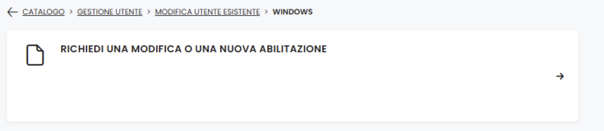

# E2E Project 

## Table of Contents

1. [How to Run](#how-to-run)
   - [First Time Setup](#how-to-run-first-time-for-a-new-report)
   - [Subsequent Runs](#how-to-run-after-first-time)

2. [Files](#files)
   - [⚙️ config.yaml](#️-configyaml)
   - [🏃‍♀️ e2e_update.bat](#️-e2e_updatebat)
   - [🔙 backorder.py](#-backorderpy)
   - [🔋 charged_v1.sql](#-charged_v1sql)
   - [🔋 charged.py](#-chargedpy)
   - [⌚ otif_append.py](#-otif_appendpy)
   - [💸 sales.py](#-salespy)
   - [🏛️ stock.py](#-stockpy)

3. [Accessibility](#accessibility)
   - [SQL Server](#sql-server)
   - [Virtual Env Folder and Virtual Machine](#virtual-env-folder-and-virtual-machine)

4. [Directory Tree](#-directory-tree)
## How to run (first time for a new report)

0) Update all the boxi queries. Read [this file](./update_boxi_query_readme.lnk) for more information.

1) Open the file `config/config.yaml` and set:
   - `release`: .This is the current release you want to monitor. Use the format 'YYYY NN'.
   - `release_ly`: .This is the past release you want to use as "last year" reference. Use the format 'YYYY NN'.
   - `npi_sql_server` (change only if you are sure): change the `server` and the `database` of the SQL Server for the "Apollo" data (charged data).

2) Run the file `e2e_update.bat`. It should be already scheduled inside *Task Scheduler* within the server `10.200.112.107` (*please refer to Roleof or someone inside the Data Science Community if you cannot open the server*). Refer to [Accessibility](#accessibility) section whether you cannot run the file.

## How to run (after first time)
Run the file `e2e_update.bat`. Usually, once per week. It should be already scheduled inside *Task Scheduler* within the server `10.200.112.107` (*please refer to Roleof or someone inside the Data Science Community if you cannot open the server*).  Refer to [Accessibility](#accessibility) section whether you cannot run the file.

## Files
### ⚙️ config.yaml
The `config/config.yaml` is essential to run correctly all the scripts and it should be updated every time is need. For instnace, it has to be updated:
- When you create a new report and you have to change the releases
- When The emails from and to whom you want to send the email of the status of the scripts.
- When the SQL Server of the Apollo system changes

### 🏃‍♀️ e2e_update.bat
The file `src/e2e_update.bat` runs each python script (once for each type of data) by exploiting the conda environment `C:\Users\mottad\AppData\Local\miniconda3\envs\e2e_env`. Notice that the environement is inside `mottad`. Hence if you are not me (lol) this file as well as all the python scripts couldn't run properly.

### 🔙​ backorder.py
#### System Setup and Loading:

- Retrieve project folders paths(`backorder\input`, `backorder\history`), loads operational settings from `config.yaml`, and activates a dedicated logging system.

- Reads the raw backorder data from the `backorder\input\backorder.txt` file in the input folder, enforcing strict data types for analysis.

#### Data Quality Correction (Temporal Consistency):

- The script resolves a common data loading anomaly where the same `Year Week` is associated with two or more different Load Dates (`Pipeline - DtLoad`). For instane, this means that Boxi took the picture of week 1 in week 2 together with the picture of week 2.

- The Correction: To maintain historical sequence, the data associated with the oldest load date in the conflicting week is reassigned to the previous `Year Week` (by subtracting 7 days). This adjustment prevents record duplication.

#### Archiving and Maintenance:

- A complete, corrected copy of the data is saved to the `backorder\history` folder with a unique timestamp for auditing.

- The clean, corrected data is saved in a standard format (`\backorder\backorder.csv`), making it ready for use by other systems.

- The original input file (`backorder\input\backorder.txt`) is deleted from the input folder upon successful processing.

#### Notifications and Error Management:

- An email is sent to the planning team upon successful completion of the data processing.

- An immediate email alert is sent if a critical exception occurs (e.g., the input file is missing), detailing the error for prompt intervention.


### 🔋 charged_v1.sql
#### Query Purpose and Overview:
- Retrieves cumulative charged quantities aggregated by week and by event type (PQ, PQ1, PQ2, PQ3, PQ4, PQ5, FQ1, FQ2), filtered by specified release versions from the SQL Server database.
- Pivots event-based data into columnar format, consolidating multiple event records into a single row per update week, geography, cluster, product, and production facility.

#### Data Source and Filtering:
- Queries the `[NPI].[MODEL].[vFactSpreadingEvents_Historical]` table, filtering for event keys matching promotion and fulfillment quarters (PQ, PQ1-PQ5, FQ1-FQ2).
- Filters by `ClusterKey` (release versions, e.g., '2025-N2', '2024-N2') to isolate data relevant to the specified release.
- Extracts model and grid identifiers from product keys and variants, maintaining dimensional context throughout the query.

#### Event Pivoting and Aggregation:
- Pivots each event type (PQ, PQ1-PQ5, FQ1-FQ2) into separate column groups, capturing event quantities (`EventQty_*`), pre-week charged quantities (`ChargedPreWeekN_*`), and post-week charged quantities (`ChargedPostWeekN_*`).
- For each event, captures the event year-week (`EventYearWeek_*`) and exclusivity key (`ExclusivityKey_*`) to preserve promotional channel and timing information.
- Uses conditional aggregation (SUM for quantities, MAX for categorical values) to consolidate multiple event records into single rows during the initial CTE grouping.

#### Dimensional Context:
- Maintains key dimensions including `UpdateYearWeekKey` (data update week), `GeographyKey` (production region, e.g., EXT for ZB), `ProductionSchedulerKey` (production facility), and `WK` (week component extracted from UpdateYearWeekKey).
- Includes inventory context with `TotalChargedQuantity` (total quantity charged), `TotalOrderedQuantity` (total quantity ordered (production orders) including WIP), and `PaperQuantity` (quantities in production pipeline not yet started).

#### Final Aggregation:
- Groups pivoted event data by update week, geography, cluster, product, grid, week component, and production scheduler to produce a denormalized output suitable for demand planning analysis.
- Final aggregation sums event quantities and ordered quantities across event types while preserving event-specific dimensional attributes.


### 🔋 charged.py
#### System Setup and Loading:
- Retrieve project folders paths (`data\charged`, `query`), loads operational settings from `config.yaml`, and activates a dedicated logging system.
- Connects to the SQL Server using the provided server and database credentials from the configuration.
- Reads the SQL query from `query\charged_v1.sql` and executes it against the database, filtering data by release versions specified in the configuration `config.yaml`.

#### Data Processing and Enrichment (Weekly Charged Quantities):
- Imports master data from `data\master_data\master_data.xlsx` containing product information (Model, Size, Color, UPC).
- Creates SKU identifiers by combining Model and Color-Size attributes for both the charged data and master data.
- Performs an inner join with master data to keep only relevant records and enrich the dataset with accurate UPC mappings.
- Aligns the `UpdateYearWeekKey` format to ensure consistency, adjusting week numbers for last-year comparisons by adding 100 to distinguish historical periods.
- Calculates weekly charged quantities by differentiating the cumulative `TotalChargedQuantity` grouped by UPC, capturing week-over-week changes in demand.

#### Data Storage and Archiving:
- The processed, enriched charged data is saved to `data\charged\charged.csv` in semicolon-delimited format, ready for downstream analysis and reporting.
- All data transformations maintain data integrity through explicit type conversions and formatting (e.g., 6-digit zero-padded YearWeek keys).

#### Notifications and Error Management:
- An email is sent to the planning team upon successful completion of the data processing, confirming the release version processed.
- An immediate email alert is sent if a critical exception occurs (e.g., database connection failure, missing query file, or data validation errors), detailing the error for prompt intervention.

### ⌚ otif_append.py
#### System Setup and Loading:
- Retrieve project folders paths (`data\otif`, `data\otif\actual`, `data\otif\history`), loads operational settings from `config.yaml`, and activates a dedicated logging system.
- Reads the raw OTIF actual data from the `data\otif\actual\00_OTIF_Reclass.txt` file with strict data type enforcement, supporting encoding compatibility for legacy systems.

#### Data Loading, Filtering, and Backup (Release-Based Processing):
- Filters the loaded OTIF data by the specified release value from the configuration `config.yaml` to isolate relevant records for the current processing cycle.
- Creates a timestamped backup of the filtered data and saves it to the `data\otif\history` folder for audit trail and historical reference purposes.
- If the input file is missing, raises a detailed error indicating the file may have already been processed or suggesting contact with the Gruppo Wholesale Forecasting team for investigation.

#### Data Cleaning and Temporal Alignment:
- Renames columns to standardized, user-friendly names for consistency across the system (e.g., "Yyear" becomes "year", "OTIF Num Shipped Qty Net" becomes "shipped_qty_net").
- Constructs temporal dimension fields by calculating a date from the ISO year and week, then adds 7 days to shift the reporting period, extracting new `otif_year`, `otif_month`, `otif_quarter`, and `otif_week` values from this offset date.
- Selects and reorders columns to maintain a standardized output structure for downstream consumption.

#### Data Enrichment and Incremental Append:
- Loads the existing main OTIF file (`data\otif\otif.csv`) if it exists, or creates a new one if this is the first run.
- Identifies and appends only new rows by comparing the cleaned actual data against existing records, preventing duplicate records and ensuring data consistency.
- Enriches the dataset by reconstructing the UPC column through an inner join with master data (`data\master_data\master_data.xlsx`), creating SKU identifiers from Model, Color, and Size attributes for accurate product mapping.
- Saves the updated, enriched OTIF data back to the main `data\otif\otif.csv` file in semicolon-delimited format.

#### File Maintenance and Archiving:
- The original input file `data\otif\actual\00_OTIF_Reclass.txt` is automatically deleted from the actual folder upon successful processing to prevent re-processing.

#### Notifications and Error Management:
- An email is sent to the planning team upon successful completion of the data processing, confirming the release version processed and rows appended.
- An immediate email alert is sent if a critical exception occurs (e.g., input file missing, database connection failure, or data validation errors), detailing the error for prompt intervention.

### 💸 sales.py
#### System Setup and Loading:
- Retrieve project folders paths (`data\sales`, `data\sales\input\current`, `data\sales\input\past`, `data\sales\history`), loads operational settings from `config.yaml`, and activates a dedicated logging system.
- Reads the current sales data from `data\sales\input\current\sales_&_shipping_current.txt` and the historical sales data from `data\sales\input\past\sales_&_shipping_past.txt`, enforcing strict data types and UTF-8 encoding for consistency.

#### Data Loading and Temporal Alignment (Year Adjustment):
- Loads both current and past sales datasets, handling file not found errors with descriptive messages guiding users to obtain missing files from appropriate sources (Business Objects for past data, Gruppo NPI Demand Planning for current data).
- Normalizes the Year field in past sales data by removing formatting artifacts (decimal points), incrementing the year by 1 to align with the current reporting period, and ensuring consistent 4-digit formatting.
- This adjustment maintains temporal consistency and prevents year misalignment when combining historical and current datasets.

#### Data Consolidation and Integration:
- Concatenates the current and past sales datasets into a single unified DataFrame, combining all records while preserving data integrity and maintaining chronological order.
- The consolidated sales data is saved to `data\sales\sales_&_shippings.csv` in semicolon-delimited format, creating a comprehensive historical and current sales dataset ready for downstream analysis.

#### Archiving and File Maintenance:
- A timestamped backup of the current sales data is saved to `data\sales\history` folder for audit trail and historical reference purposes before final processing.
- The original input file `data\sales\input\current\sales_&_shipping_current.txt` is automatically deleted from the input folder upon successful processing to prevent re-processing and maintain folder organization.

#### Notifications and Error Management:
- An email is sent to the planning team upon successful completion of the data processing.
- An immediate email alert is sent if a critical exception occurs (e.g., input files are missing, data format inconsistencies, or encoding errors), detailing the error for prompt intervention.

### 🏛️ stock.py
#### System Setup and Loading:
- Retrieve project folders paths (`data\stock`, `data\stock\input\current`, `data\stock\input\past`, `data\stock\history`), loads operational settings from `config.yaml`, and activates a dedicated logging system.
- Reads the current stock data from multiple files matching the pattern `REPORT_NPI_Stock*.txt` in `data\stock\input\current` and the historical stock data from `data\stock\input\past`, enforcing strict data types and UTF-8 encoding for consistency.

#### Data Loading and Consolidation (Multi-File Aggregation):
- Dynamically loads all current stock files from the current folder using glob pattern matching, concatenating them into a single unified dataset to aggregate data from multiple sources.
- Loads historical stock data from the past folder using the same multi-file aggregation approach, handling file not found errors with descriptive messages guiding users to obtain missing files from appropriate sources (Business Objects for past data, Gruppo NPI Demand Planning for current data).
- Concatenates all loaded stock files within each category (current and past) before proceeding to the next processing step.

#### Data Quality Correction (Temporal Alignment):
- Normalizes temporal dimensions in past stock data by incrementing the Year field by 1 to align with the current reporting period and ensure consistent 4-digit formatting.
- Adjusts the Year Week field in past stock data by adding 100 to distinguish historical periods from current periods, then ensures consistent 6-digit formatting to maintain alignment across the dataset.
- This adjustment prevents temporal misalignment and record duplication when combining historical and current datasets.

#### Data Consolidation and Integration:
- Concatenates the current and past stock datasets into a single unified DataFrame, combining all records while preserving data integrity and maintaining chronological order.
- The consolidated stock data is saved to `data\stock\stocks.csv` in semicolon-delimited format, creating a comprehensive historical and current stock dataset ready for downstream analysis.

#### Archiving and File Maintenance:
- A timestamped backup of the current stock data is saved to `data\stock\history` folder for audit trail and historical reference purposes before final processing.

#### Notifications and Error Management:
- An email is sent to the planning team upon successful completion of the data processing.
- An immediate email alert is sent if a critical exception occurs (e.g., input files are missing, data format inconsistencies, or encoding errors), detailing the error for prompt intervention.


## Accessibility
If you have some problem to run the scripts, probably you have to request the access to SQL Server databases or folders.

### SQL Server
In order to run `charged.py` you have to have access to the SQL Server `LOISCNPIDBP01`, database `NPI`. To get the access, open a ticket or ask Lodovico d'Incau


### Virtual Env Folder and Virtual Machine
All the scripts as well as `update_e2e.bat` work thanks to the virtual environment stored in `C:\VirtualEnv\Demand\e2e_env` inside the virtual machine `10.200.112.107`. If you cannot run the scripts properly, you have to ask the access to that folder (and all its subfolders and files) and virtual machine. Please ask Roelof or the admin of the virtual machine.

## 📂 Directory Tree

```text
script/
├── config/               # Configuration management
│   └── config.yaml       # Main configuration file (release, server, etc.)
├── core/                 # Core components required for script initialization
│   └── config_loader.py  # Module responsible for loading and validating config.yaml
├── query/                # Directory containing SQL queries or data definition files
├── src/                  # Source Code: Business logic divided by domain
│   ├── backorder/        # Logic related to backordered items
│   ├── charged/          # Logic related to charges/costs processing
│   ├── otif/             # OTIF (On Time In Full) metrics calculation and management
│   ├── sales/            # Sales data analysis and processing
│   ├── stock/            # Inventory and stock management
│   └── e2e_update.bat    # Batch script for Windows updates or process execution
├── utils/                # Shared support libraries and helpers
│   ├── constant.py       # Global project constants definitions like OS
│   ├── logger.py         # Module for logging configuration and handling
│   └── utils.py          # Generic reusable utility functions like "send_email"
├── .gitignore            # List of files and folders excluded from Git versioning
├── e2e.code-workspace    # VS Code workspace configuration settings
├── environment.yaml      # Environment dependency file (e.g., for Conda)
└── README.md             # General project documentation